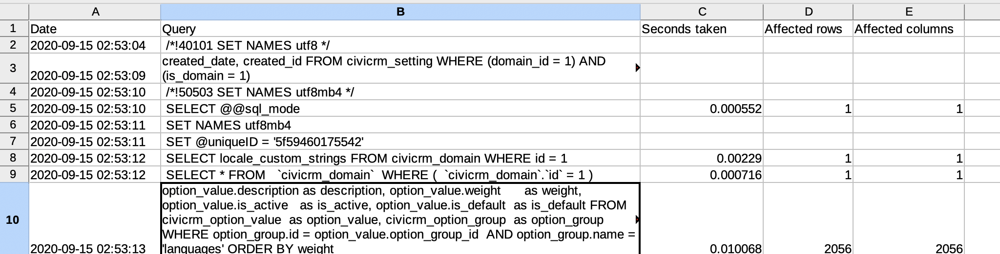

# org.wikimedia.systemtools

This extension provides 2 helpers for analysing sql & redis output for performance purposes

Full documentation is at https://docs.civicrm.org/system-tools/en/latest/



The extension is licensed under [AGPL-3.0](LICENSE.txt).

## Requirements

* PHP v7.4+
* CiviCRM 5.30+

## Installation (Web UI)

This extension has not yet been published for installation via the web UI.

## Installation (CLI, Zip)

Sysadmins and developers may download the `.zip` file for this extension and
install it with the command-line tool [cv](https://github.com/civicrm/cv).

```bash
cd <extension-dir>
cv dl org.wikimedia.systemtools@https://github.com/FIXME/org.wikimedia.systemtools/archive/master.zip
```

## Installation (CLI, Git)

Sysadmins and developers may clone the [Git](https://en.wikipedia.org/wiki/Git) repo for this extension and
install it with the command-line tool [cv](https://github.com/civicrm/cv).

```bash
git clone https://github.com/FIXME/org.wikimedia.systemtools.git
cv en systemtools
```
